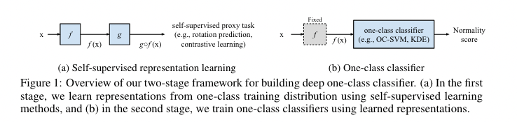

# DROC
Pyrorch implementation of the paper: 
[Learning and Evaluating Representations for Deep One-class Classification](https://openreview.net/forum?id=HCSgyPUfeDj) 
published at [ICLR 2021](https://iclr.cc/) as a conference paper
by Kihyuk Sohn, Chun-Liang Li, Jinsung Yoon, Minho Jin, and Tomas Pfister

## Run
To run the contrastive learning for anomaly detection, please run

- `script/run_contrastive_da.sh`

